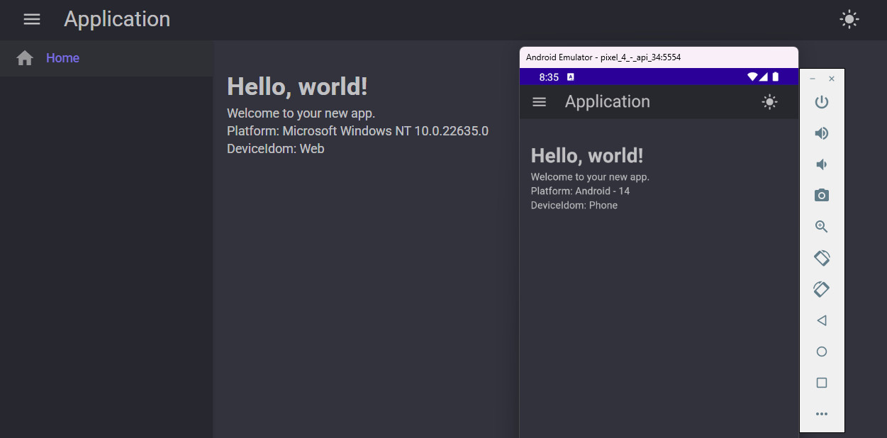

# MudHybrid Template

## Description
MudHybrid Template is a .NET MAUI and Blazor project template that provides a hybrid application framework. It leverages MudBlazor for UI components and supports both web and native platforms.

## Features
- Hybrid application framework using .NET MAUI and Blazor
- MudBlazor UI components
- Dark mode support
- Secure storage using ProtectedLocalStorage
- Responsive layout with MudLayout, MudAppBar, MudDrawer, and MudMainContent

## Installation
You can install the VSIX from the Visual Studio Marketplace using the following link:
[Visual Studio Marketplace - MudHybrid VSIX](https://marketplace.visualstudio.com/items?itemName=AntonyLu.321)

## Contributing
We welcome contributions! Please follow these steps to contribute:
1. Fork the repository.
2. Create a new branch for your feature or bugfix.
3. Make your changes and commit them with clear and concise messages.
4. Push your changes to your fork.
5. Create a pull request to the main repository.

## Troubleshooting
- If you encounter issues with building or running the project, ensure that you have the correct .NET SDK installed.
- Check for any missing dependencies and restore them using `dotnet restore`.
- For platform-specific issues, refer to the official .NET MAUI and Blazor documentation.